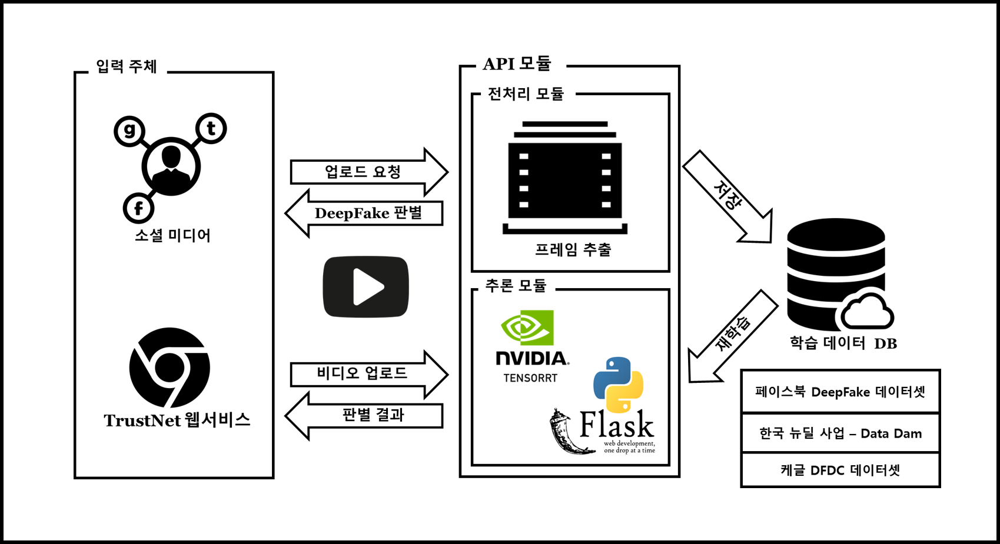

# TrustNet Main Model Repository


This is TrustNet Team's Main Model Repository.
This project sponsored by Software Maestro Program.

## Building docker image




All libraries and enviroment is already configured with Dockerfile. 

It requires docker engine https://docs.docker.com/engine/install/ubuntu/ and  nvidia docker in your system https://github.com/NVIDIA/nvidia-docker.

To build a docker image run  
```
$docker build -t df .
```


## Running docker 
```
$docker run --gpus=all --ipc=host --rm  --volume <DATA_ROOT>:/dataset -it df
```

## Data preparation
At first, you should download dfdc_train_data from https://www.kaggle.com/c/deepfake-detection-challenge/data

Once DFDC dataset is downloaded all the scripts expect to have `dfdc_train_xxx` folders under data root directory. 

Preprocessing is done in a single script **`preprocess_data.sh`** which requires dataset directory as first argument. 
It will execute the steps below:  


##### 1. Find face bboxes
To extract face bboxes I used facenet library, basically only MTCNN. 
```
$python preprocessing/detect_original_faces.py --root-dir DATA_ROOT
```
This script will detect faces in real videos and store them as jsons in DATA_ROOT/bboxes directory

##### 2. Extract crops from videos
To extract image crops I used bboxes saved before. It will use bounding boxes from original videos for face videos as well.
```
$python preprocessing/extract_crops.py --root-dir DATA_ROOT --crops-dir crops
```
This script will extract face crops from videos and save them in DATA_ROOT/crops directory
 
##### 3. Generate landmarks
From the saved crops it is quite fast to process crops with MTCNN and extract landmarks  
```
$python preprocessing/generate_landmarks.py --root-dir DATA_ROOT
```
This script will extract landmarks and save them in DATA_ROOT/landmarks directory
 
##### 4. Generate diff SSIM masks
```
$python preprocessing/generate_diffs.py --root-dir DATA_ROOT
```
This script will extract SSIM difference masks between real and fake images and save them in DATA_ROOT/diffs directory

##### 5. Generate folds
```
$python preprocessing/generate_folds.py --root-dir DATA_ROOT --out folds.csv
```
By default it will use 16 splits to have 0-2 folders as a holdout set. Though only 400 videos can be used for validation as well. 


## Training

Training 5 B7 models with different seeds is done in **`train.sh`** script.

During training checkpoints are saved for every epoch.

You can select the model architecture that you want, for details, see the example folder.

if you want to download pretrained weights in TrustNet API,

you can run **`getweights.sh`** . 

This is our result of model compare.


## Hardware requirements
Mostly trained on 2xTesla V100 GPUs, thanks to NIPA and AI Hub where I got these gpus https://aihub.or.kr/

Overall training requires 2 GPUs with 12gb+ memory. 

Batch size needs to be adjusted for standard 1080Ti or 2080Ti graphic cards.

As I computed fake loss and real loss separately inside each batch, results might be better with larger batch size, for example on V100 gpus. 

Even though SyncBN is used larger batch on each GPU will lead to less noise as DFDC dataset has some fakes where face detector failed and face crops are not really fakes.   

## Plotting losses to select checkpoints
```
$python plot_loss.py --log-file logs/<log file>`
```


## Inference

You can use various inference engines such as PyTorch, ONNX, TensorRT by implemented predict modules.

Kernel is reproduced with `predict_with_<Framework>.py` script.

and you can also make a class activation map with `deepfake_cam.py script.


if you want to run Triton GPU Scheduling, 

## Triton Inference Server

### Install Docker Image

if you want to run Trustnet Models with GPU Scheduling, 
```
docker pull nvcr.io/nvidia/tritonserver:20.10-py3
```
### Run On System with GPUs

Before Run Triton you *should* download TrustNet Models and Triton Config files by `getweights.sh`

You can use tensorrt_models as model repository
```
$docker run --gpus=all -p8000:8000 -p8001:8001 -p8002:8002 -v tensorrt_models:/models nvcr.io/nvidia/tritonserver:20.10-py3 tritonserver --model-repository=/models
```
After you start Triton you will see output on the console showing the server starting up and loading the model.
```
I1002 21:58:57.891440 62 grpc_server.cc:3914] Started GRPCInferenceService at 0.0.0.0:8001
I1002 21:58:57.893177 62 http_server.cc:2717] Started HTTPService at 0.0.0.0:8000
I1002 21:58:57.935518 62 http_server.cc:2736] Started Metrics Service at 0.0.0.0:8002
```

## The hardware we used
- CPU: Intel(R) Xeon(R) Gold 5120 CPU @ 2.20GHz
- RAM: 180 GB
- GPU: NVIDIA Tesla V100 SXM2 32 GB x 2
- SSD: 2 TB

## Thanks to


