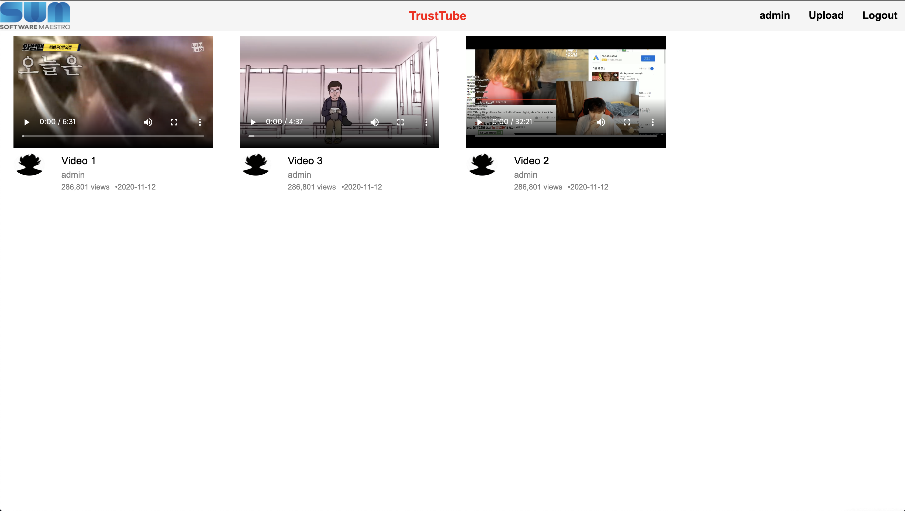
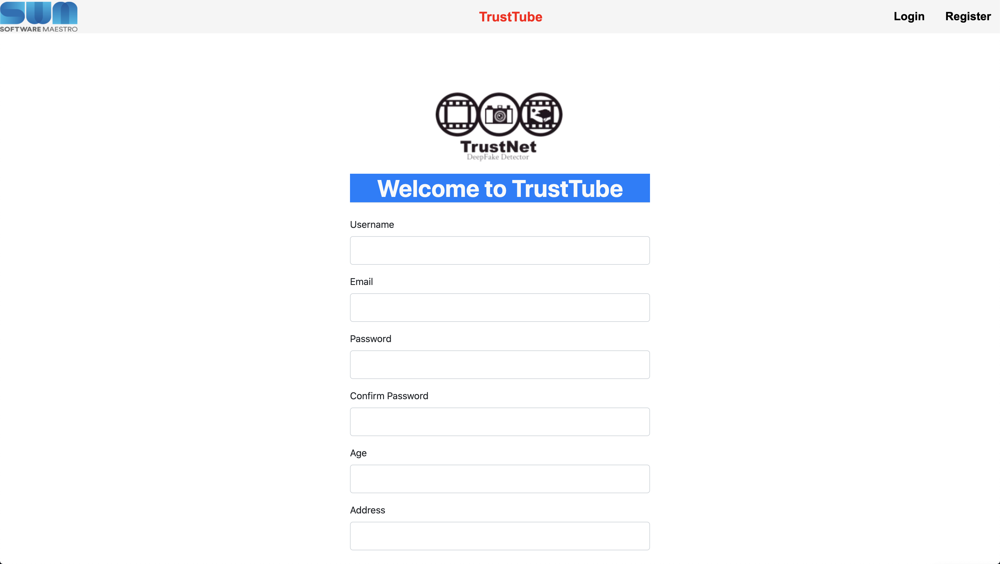
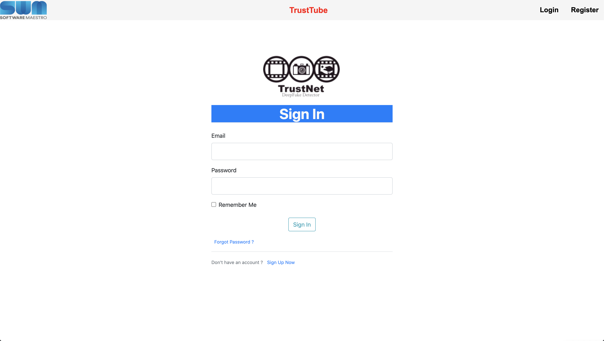
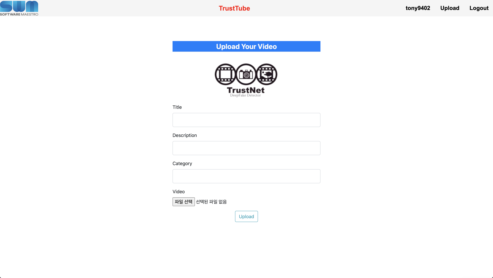
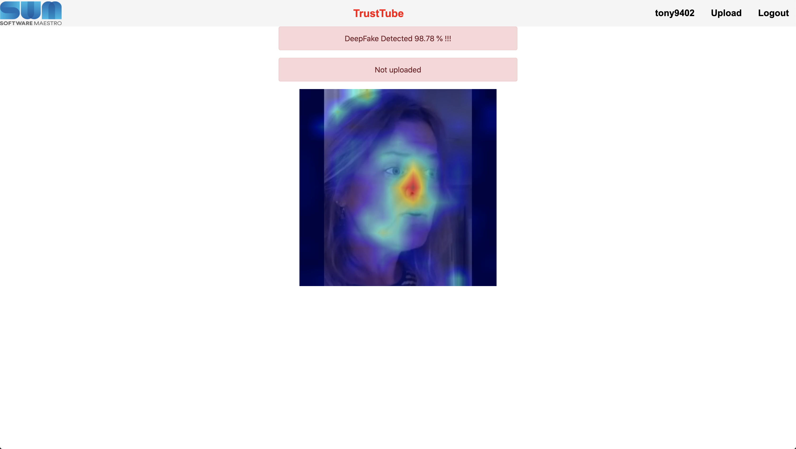

# TrustTube Server

[](https://git.swmgit.org/swmaestro/trustnet-2)
[](https://github.com/pytorch/pytorch/releases/tag/v1.7.0)
[](https://github.com/NVIDIA/TensorRT/releases/tag/20.10)
[](https://github.com/opencv/opencv/releases/tag/4.4.0)
[](https://github.com/pallets/flask/releases/tag/1.1.2)
[](https://github.com/triton-inference-server/server)

## How to run

### Building docker image & Running docker

```bash
docker build -t trustnetapi .
docker run --name trustnetapi --gpus all -it -d --net=host --ipc=host -v <your workspace>:/to/path/dir/ trustnetapi
```

### Instructions Python packages

```bash
pip3 install -r requirements.txt
```

### Run

```bash
./run
```


## TrustTube Preview

### TrustTube Main Page



### TrustTube Register Page



### TrustTube Login Page



### TrustTube Upload Page




### DeepFake Detected page with (Class Activation Map)




## Directory Structure :

	|-- Dockerfile
	|-- README.md
	|-- api
	|   |-- TrustNetAPI.py
	|   |-- classifiers.py
	|   |-- deepfake_utils.py
	|   |-- grad_cam.py
	|   `-- weights
	|-- app
	|   |-- __init__.py
	|   |-- forms.py
	|   |-- models.py
	|   |-- routes.py
	|   |-- static
	|   |   |-- avatar
	|   |   |   |-- avatar.png
	|   |   |   `-- student.png
	|   |   |-- cover_pics
	|   |   |   `-- cover.png
	|   |   |-- css
	|   |   |   |-- kopubdotum.css
	|   |   |   |-- main.css
	|   |   |   `-- style.css
	|   |   |-- logo
	|   |   |   |-- sw_maestro.png
	|   |   |   `-- trustNet.png
	|   |   `-- videos
	|   `-- templates
	|       |-- CAM.html
	|       |-- account.html
	|       |-- home.html
	|       |-- layout.html
	|       |-- login.html
	|       |-- register.html
	|       |-- update_video.html
	|       |-- upload.html
	|       `-- video.html
	|-- config.py
	|-- images
	|   |-- Homepage.png
	|   |-- Homepage1.png
	|   |-- Homepage2.png
	|   |-- Homepage3.png
	|   |-- Homepage4.png
	|   `-- Homepage5.png
	|-- migrations
	|   |-- alembic.ini
	|   |-- env.py
	|   |-- script.py.mako
	|   `-- versions
	|       `-- b0e1bb55d78d_create_models.py
	|-- requirements.txt
	|-- reset
	|-- run
	|-- server.py
	|-- youtube.code-workspace
	`-- youtube.db
